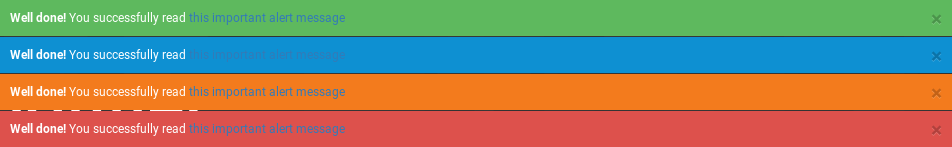
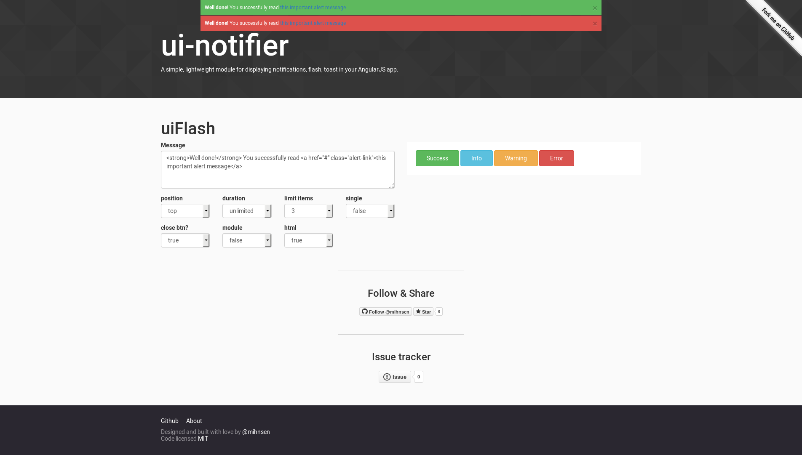

ui-notifier ([live demo](http://mihnsen.github.io/ui-notifier/)) [](https://travis-ci.org/mihnsen/ui-notifier) [](https://codeclimate.com/github/mihnsen/ui-notifier)
=========

A simple, lightweight module for displaying notifications, flash messages, toasts in your AngularJS app.

[](http://mihnsen.github.io/ui-notifier)

IE9+ (AngularJS v1.3.x no longer supports IE8) and the latest versions of Chrome, FireFox and Safari have been tested and are supported.  If you do run across any issues, please submit a [new issue](https://github.com/mihnsen/ui-notifier/issues) and I'll take a look - or better yet - submit a PR with the bug fix and I'll merge it in.

You can check out the vitals and demo here: [http://mihnsen.github.io/ui-notifier](http://mihnsen.github.io/ui-notifier)

#### First version
With first version, we provide a Flash service to show flash message in your application with a ton of features:
- 4 type of message: success, info, warning, error
- Setitng message position (top, bottom)
- Setting message timeout (provide timeout for each message)
- Setting limit messages
- Show message on module
- Html message supported
[](http://mihnsen.github.io/ui-notifier)

#### Comming soon
With next version we will provide:

- Notifications
- Toasts


Implementation
==============

### Requirements

AngularJS is the only dependency.  Animation is achieved with pure JS, jQuery not necessary.

### Installation

You can install ui-notifier with Bower.

    bower install ui-notifier --save

You can also install ui-notifier with npm.

    npm install ui-notifier --save


And as always, you can download the source files straight from this repo - they're located in the `dist` dir.  Be sure to include the minified version of both js and css files.

### Usage

After including *ui-notifier.min.js* and *ui-notifier.min.css*, inject the ui-notifier provider into your project.

```javascript
var app = angular.module('App', ['uiNotifier']);
```

Now you can trigger notifications from anywhere in your app.  To display a notification, just use the `set` method.

```javascript
uiFlash.success('You have added success message!');
```

To specify the *type* of notification to display, provide type funxtion. (For available types, check the [definitions](#definitions) below.)

```javascript
uiFlash.success('Your message goes here!', 5000);
uiFlash.info('Your message goes here!');
uiFlash.warning('Your message goes here!');
uiFlash.error('Your message goes here!');
```

Advanced Usage
==============

### Default Configuration

You can override the default options for all notifications by using the `config` method.  None of these options are required. (For available options, check the [definitions](#definitions) below.)

```javascript
uiNotifier.config({
    theme: 'pure',
    position: 'bottom',
    duration: 3000,
    type: 'info',
    sticky: false,
    button: true,
    html: false
});
```

Default configuration options can be set during the `run()` block.  If your app utilizes a global controller, the config options could be set there just as well.

### Provide Configurations
You can also pass an object of options to flash messages.  You can pass through any combination of our available options here as well. Here is setting in App.config (For available options, check the [definitions](#definitions) below.)  For example:

```javascript
uiFlash.setOptions({
    position: 'top',
    duration: 3000,
    limit: 3,
    single: false,
    closeBtn: true,
    module: false,
    html: false
});
```

### Directive confirguration
Two using this serivce, we have to register a directive where message showed. You also configuration option via directive attributes.

```javascript
<div ui-flash-instance
    position="top",
    duration="5000",
    limit="3",
    single="false",
    close-btn="true",
    module="false"
    html="false"
></div>
```

This will give the user the option of closing the notification themselves.  If you need to dismiss a notification manually, you can do so with the `dismiss` method like this:

```javascript
uiNotifier.dismiss();
```

If you'd prefer to dismiss the notification programmatically and prevent the user from doing so, you can add an option to remove the button:

```javascript
uiNotifier.set('This is sticky without a button.', {
    sticky: true,
    button: false
});
```

*Any time a notification is set to sticky, the duration attribute will be ignored since the notification will not be automatically fading out.*

### HTML Notifications

HTML notifications will allow you to display messages with HTML content in them.  To do this, you'll need to set the `html` attribute to true:

```javascript
uiFlash.setOptions({
    html: true
});
```
In order for HTML notifications to display, you are required to include the [ngSanitize](https://docs.angularjs.org/api/ngSanitize) script in your app (eg, via Google CDN, Bower, or code.angular.org).  There's no need to add it as a dependency to uiNotifier.  If uiNotifier has found the ngSanitize script, it will add it as a dependency to the uiNotifier module dynamically.  Once included, you just need to toggle the `html` attribute to true and the module will handle the rest.

If you don't have ngSanitize included and you do set `html` to true, uiNotifier will gracefully degrade back to the default message display and print a debug message to remind you in your browser's console.

### Module flash

By specifying a `target` option, you are able to control where your notifications are displayed.  By default, the target is set to the body tag but you may provide any other CSS selector in order to control where the notification is appended.  For example:

```javascript
uiFlash.setOptions({
    module: true
});
```

** Notifications that have a custom target specified are set to display with absolute positioning, overriding the default fixed positioning.  It's impossible to tailor uiNotifier's style to fit every situation for every app, so you may have to tweak the styles to fit your specific needs when not appending notifications to the body tag - using anything other than the default target.

### Notification id returned
When we add a message an unique id returned, We can using this id to control the message.

```javascript
var id = uiFlash.error('This is an error message');
$timeout(function() {
    uiFlash.close(id);
}, 5000);
```

### Custom Themes

The position, size, color, alignment and more are all styled based on the notification's classes and are all specified in the CSS file. See the [style definitions](#styles) below to see which classes can be used to override any of the styles within your own application.


```Scss
.flash.flash-success {
    background-color: #5eb95e
}
.flash.flash-info {
    background-color: #0e90d2
}
.flash.flash-warning {
    background-color: #f37b1d
}
.flash.flash-error {
    background-color: #dd514c
}
```

Definitions
===========

### Methods

#### show(type, message, timeout)
displays a notification message and sets the formatting/behavioral options for this one notification.
- **message**: *string* - *required* - the message to display in your notification.
- **type**: *string|object* - *optional* - the type of notification to display (string) OR an object of options.
    - types:
        - info *(default)*
        - error
        - success
        - warning
- **timeout**: timeout of message

#### success(message, timeout)
Show success message
#### info(message, timeout)
Show info message
#### warning(message, timeout)
Show success message
#### error(message, timeout)
Show error message

#### setOptions(options)
sets default settings for all notifications to take into account when displaying.
- **options** - *object* - an object of options that overrides the default settings.
    - **position**: *string* - *optional* - sets where the notifications will be displayed at in the app.
        - top *(default)*
        - bottom
    - **type**: *string* - *optional* - sets the default notification type when a type isn't explicitly set.
        - info *(default)*
        - error
        - success
        - warn
    - **duration**: *integer* - *optional* - the duration the notification stays visible to the user, in milliseconds.
    - **limit**: *integer* - *optional* - linmit the messages to show (-1 is unlimited) - 3 by default.
    - **closeBtn**: *bool* - *optional* - determines whether or not the dismiss button will show on sticky notifications.  when true, the button will display.  when false, the button wil not display.  sticky must be set to true in order to control the visibility of the dismiss button. *(true by default)*.
    - **single**: *bool* - *optional* - Show only one message. When add a message, previous messages will be hide.
    - **module**: *string* - *optional* - append message to where you place the DIRECTIVE

#### close(id)
manually closes.


Development
===========

If you've forked or cloned the project and would like to make any sort of adjustments, there are few items to make note of.  First, your system will need to have the following bits in place:

- Node & NPM
- gulp
- karma
- Scss

Second, there are a few gulp tasks that you'll be able to leverage to help validate and prepare your changes for use.

You can fire off a `gulp` or `gulp build` command manually at any time to lint, minify, and setup your demo (built in the _gh-pages dir) for testing.

```console
gulp (or gulp build)
```

Also, you can run `gulp dev` to lint, minify, and prep your demo for testing.  Once the build is complete, it'll also fire off a `watch` so that any changes that are made to the the sass, js, and demo files will automatically trigger the build script to update your project.

```console
gulp
```

To run through the configured unit tests, you can run `gulp test`.  This will fire off a series of tests that check that all default options are set correctly, all configurable options are able to be set correctly, and that all methods carry out the functionality that they're supposed to.  These tests should let you know if any of the updates that you've made have negatively effected any preexisting functionality.  Also, when the tests complete, there will be a test coverage report generated and stored in the `coverage` directory.

```console
gulp test
```

Next, you'll want to do all of your development within three locations.  If you add changes anywhere else, they're likely to be overwritten during the build process.  These locations are:

`src/scripts/ui-notifier.js` - for any script modifications.

`src/scss/ui-notifier.scss` - for any style modifications.

`demo/*` - for any modifications to the demo.

Lastly, once you've made your changes and run through the appropriate gulp tasks, your changes should be baked and ready for you to consume - located in the `dist` directory as minified js and css files.


## Authors
**Minh Nguyen**

+ [https://twitter.com/mihnsen](https://twitter.com/mihnsen)

## Credits
Inspired by https://developer.android.com/guide/topics/ui/notifiers/notifications.html

## Copyright
Copyright © 2016

## License
toastr is under MIT license - http://www.opensource.org/licenses/mit-license.php
